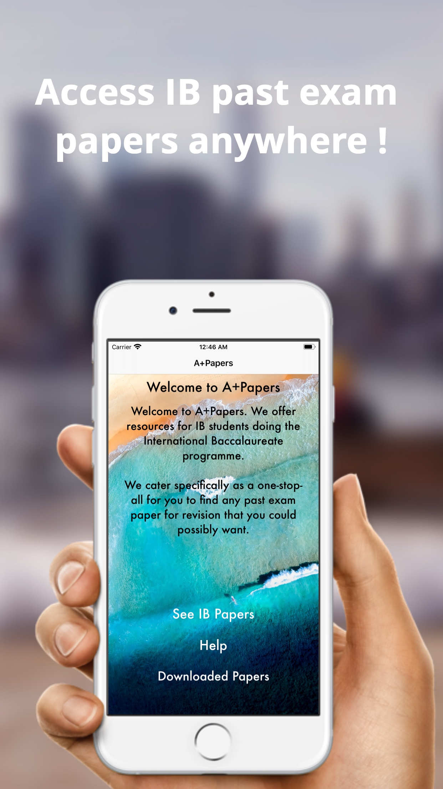
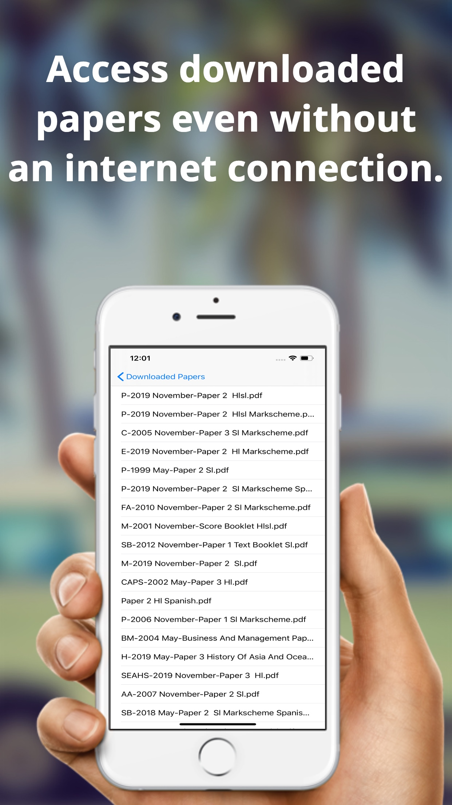

# A+Papers: IB Exam Papers 

## What is it?  

A+Papers is a family of apps designed for students enrolled in pre-university programmes such as A-Levels/IGCSE/IB Diploma to easily access past exam papers for practise as it is arguably the most effective method of preparing for the exams. It gathers resources students use daily and organises and presents it to the user in a clean and linear way that makes it easy to navigate. A+Papers has created a 33% decrease in time for students to access the past exam paper they want compared to manually searching for it on a web browser, a figure that accumulates largely when it is being done multiple times daily.

A+Papers also provides functionalities such as printing any paper with a single click using iOS native AirPrint protocol and also downloading and saving any past exam papers they want for offline use so they don't need an internet connection to study.

Amazingly, A+Papers has resonated strongly with each community of students and we've receieved many messages of appreciation, detailing how the app has helped them, made it easier and faster and just more accessible to students and this is what drives me to maintain this app for students worldwide.  

</img> </img> </img>  
  
 
</img> </img>  
  

</img> </img>  

## Downloading the app  

1. Download the project files as a ZIP [here](https://github.com/danesh-23/Shopify-Mobile-Challenge-2020/archive/master.zip) or clone the repo by pasting the command below in your command prompt/terminal.

```
 git clone https://github.com/danesh-23/Shopify-Mobile-Challenge-2020.git
```  

2. Install the pods required in the Podfile using Cocoapod dependency manager. If you have it installed, navigate to the Podfile path within the app directory and type the command below. If you dont have it installed, you can follow the guide [here](https://guides.cocoapods.org/using/getting-started.html)
```
pod install
```  
3. You should see a Pods directory generated. Only use the file with the .xcworkspace extension from now on as that is the file the dependencies are integrated with.  

That's it. You can now use the app as you like on Xcode, have fun :grin:  

## A little about this project  

I began the A+Papers family of apps journey right after I completed my A-Levels pre-university program in June 2018 and during the 18 months of the program, I realised 2 things; the most effective way of preparing for our exams were to practise past exam papers as much as we could and 2. there was a real problem in going about this, yes resources were available online but they were often slower, riddled with random popup ads, and took much longer than necessary to navigate to the papers we needed. The best alternative? Buying hard copies of the papers and a full set of question papers and mark schemes for all the available years would often cost up to $100 CAD for an average student doing four A-Level subjects.   

This is when I realised I could potentially help many students, as soon as I finished my final exams, in between the 2 months break I had from finishing the intensive 18 month program and to going to university, I decided to learn Swift and iOS development by buying a course on Udemy and learning from it. I learnt what I needed and began formulating the thoughts and ideas in my head into an app and about approx 3 weeks from buying the course, I had completed the first version of my first app; A+Papers: A-Level Papers. 

Surprisingly, the app was a hit, at least for me, it reached #40 in the Top 200 Apps under the Education category for the whole of my home country, Malaysia. This shocked me but elevated my passion and drive to develop to greater levels. Hence, my iOS journey has begun and I updated and added more features that could help students and continued to do this when i began to realise that the reason my app was doing relatively well, aside from ASO and other methods I took advantage of for rankings, is that I was addressing a need that students had and solving a problem for them and this was further backed up by students themselves emailing me and telling me how much the app has helped them etc. So, I started creating more apps similar in structure to A+Papers for programs which had similar drawbacks in how students prepared for it such as IGCSE as well as IB Diploma program that I just published earlier this year during my winter break at university.

This is a snippet of why this project came to be and Shopify asked for a project to showcase our skills and friends advised me to do their provided challenge but I believe it is a better representation of who I am to show them something I am truly passionate about and created on my own especially since it has the base requirements such as using running tasks asynchronously to update the UI, handles navigation and transition between different storyboards and views and makes use of technologies such as StoreKit, GoogleMobileAds, MessageUI, UserDefaults, WebView and various external libraries such as Alamofire and SCLAlertView to demonstrate my familiarity with installing and working with external libraries using Cocoapods.


## Project maintainers

This project is maintained by Danesh Rajasolan(me). Use of this project under the [MIT License](LICENSE.md).
